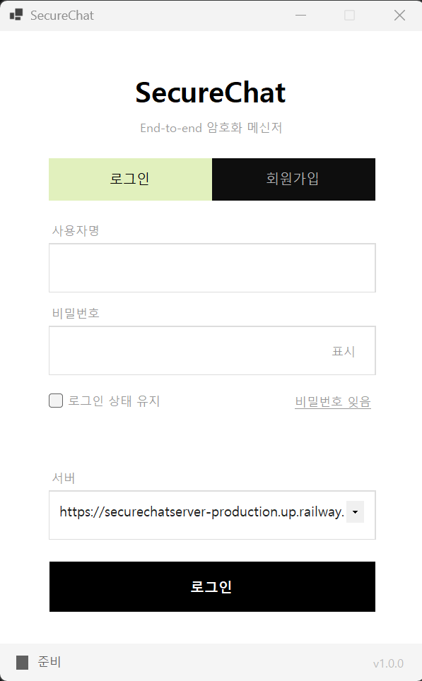
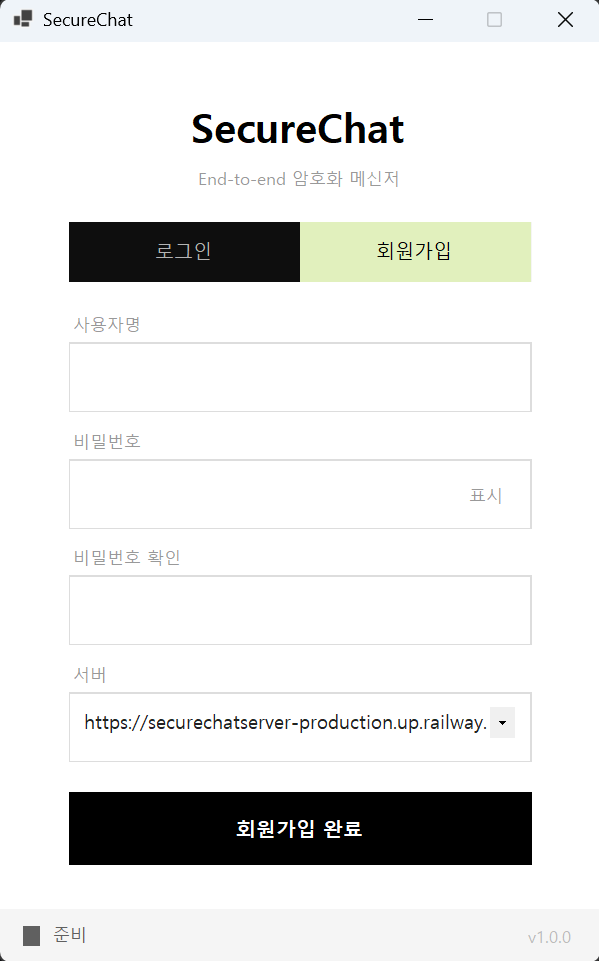
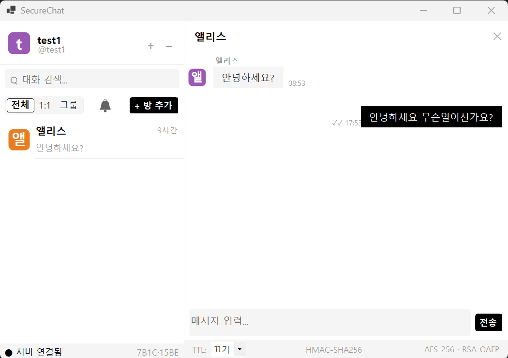
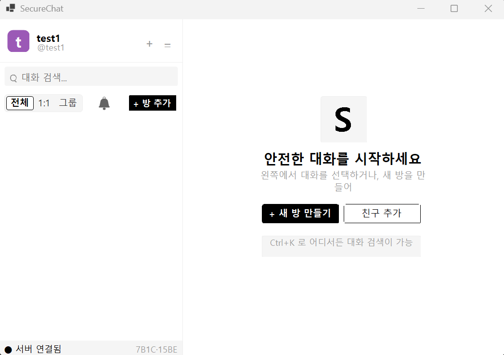
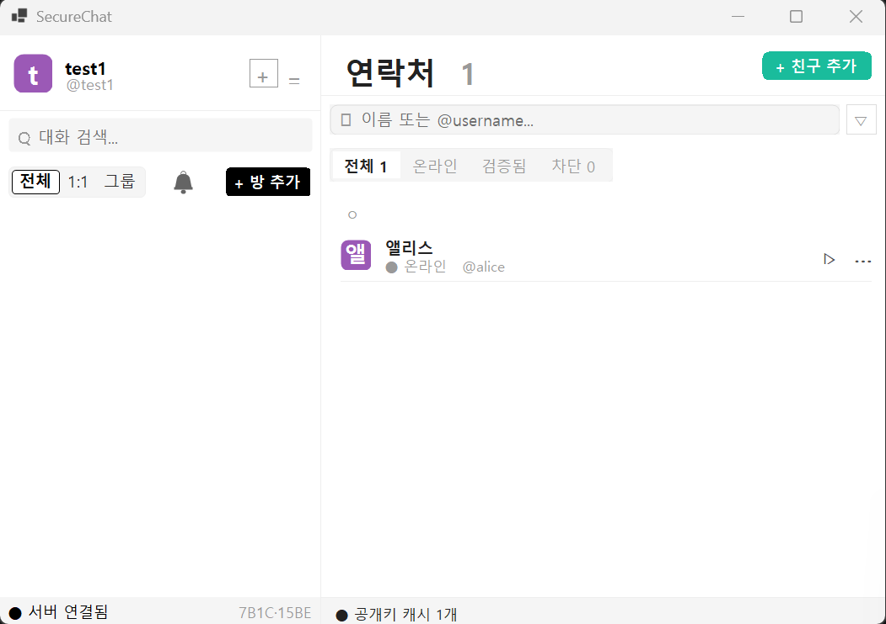
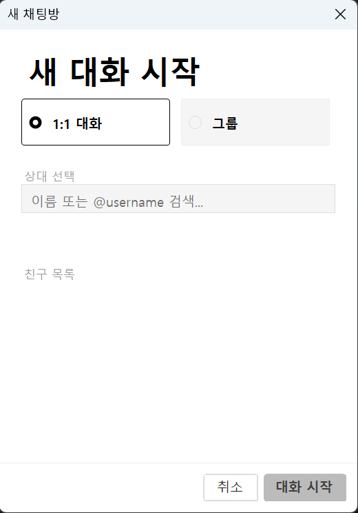

# SecureChat

> **End-to-End 암호화 메신저** — 서버가 메시지 평문을 알 수 없는 채팅 서비스.
> 🌐 배포: Railway (Docker) · `https://securechatserver-production.up.railway.app`

대화 내용은 **보내는 사람과 받는 사람의 기기에서만** 암호를 풀 수 있습니다. 메시지를 전달하는 서버조차 내용을 볼 수 없고, 서버에는 항상 **잠긴 상태의 데이터(암호문)만** 지나갑니다.

> **쉽게 말하면** — 편지를 '받는 사람만 열 수 있는 자물쇠 상자'에 넣어 보내는 것과 같습니다.
> 우체국(서버)은 상자를 배달만 할 뿐 안의 편지를 열어볼 수 없고, 설령 서버가 해킹당해도 대화 내용은 안전합니다.

기술적으로는 RSA-2048 + AES-256-GCM 암호화를 사용하며, Windows 데스크톱 클라이언트와 ASP.NET Core 백엔드를 하나의 저장소로 합친 모노레포입니다. 서버는 암호문·암호화된 키·인증 태그만 저장·중계하고, **복호화는 오직 클라이언트에서만** 이루어집니다.

| 디렉터리 | 설명 | 스택 |
|---|---|---|
| [client/](client/) | 데스크톱 클라이언트 | .NET 8 · Windows Forms |
| [server/](server/) | API + 실시간 서버 | ASP.NET Core 8 · SignalR · EF Core 8 · SQLite |

---

## 주요 기능

**보안 · 암호화**
- 🔐 **종단간 암호화** (RSA-2048 + AES-256-GCM) — 서버는 메시지 평문에 접근 불가
- 🔑 **공개키 지문 검증** — 상대 신원을 직접 확인하고 로컬에 검증 기록
- 🛡️ **로컬 키·토큰 DPAPI 암호화 저장** — 개인키는 기기 밖으로 나가지 않음
- 🎫 **JWT 인증 + 단일 세션** — 재로그인 시 이전 토큰 즉시 무효화

**메시징**
- 💬 **1:1 · 그룹 채팅** (SignalR 실시간)
- ✔️ **읽음 확인 · 전달 확인**
- ⏱️ **사라지는 메시지(TTL)** — 지정 시간 후 서버가 자동 삭제
- 📜 **메시지 히스토리** — 커서 기반 페이지네이션
- 📸 **화면 캡처 알림**

**소셜**
- 👥 **친구 요청** — 보내기·수락·거절
- 🔎 **사용자 검색** (`@username`)
- 📇 **연락처 관리** — 온라인 · 검증됨 · 차단 필터
- 👑 **그룹 관리** — 초대 · 추방 · 방장 위임

---

## 화면

### 로그인 / 회원가입
<p>
  
  &nbsp;
  
</p>

### 채팅 (E2E 암호화)
메시지 하단에 실시간 암호화 방식(`HMAC-SHA256 · AES-256 · RSA-OAEP`), 읽음 표시(√√), TTL 설정이 표시됩니다.



### 메인 / 연락처
<p>
  
  &nbsp;
  
</p>

### 새 채팅방 (1:1 / 그룹)


---

## 아키텍처

```
        client/ (WinForms)              server/ (ASP.NET Core)
   ┌───────────────────────┐  HTTPS  ┌──────────────────────────────────┐
   │ Crypto    E2E 암복호화 │  (REST) │ Api            Controller · ChatHub│
   │ Storage   DPAPI 키저장 │◀──────▶│ Application    서비스 · Result 패턴│
   │ Services  HTTP/SignalR │  WSS    │ Infrastructure EF · JWT · BCrypt  │
   │ Forms/Controls   UI    │(SignalR)│ Domain         순수 엔티티(POCO)  │
   └───────────────────────┘         └──────────────────────────────────┘
                                                  │
                                          SQLite (securechat.db)
```

백엔드는 Clean Architecture 4계층으로, 의존 방향은 **`Domain ← Application ← Infrastructure ← Api`** 한 방향입니다. 각 계층은 자기보다 안쪽(왼쪽)만 알고 바깥쪽은 모릅니다. 덕분에 UI나 데이터베이스를 바꿔도 핵심 비즈니스 로직은 영향을 받지 않습니다.

> **설계 원칙: "복호화는 클라이언트, 서버는 암호문 중계만."**
> 서버 코드 어디에도 복호화 로직이 없으며, 순수 비즈니스 로직을 담는 `Application` 레이어는 EF Core·ASP.NET·SignalR 같은 외부 기술을 전혀 참조하지 않습니다.

---

## 기술 스택

| 구분 | 클라이언트 | 서버 |
|---|---|---|
| 런타임 | .NET 8 (Windows Forms) | ASP.NET Core 8 |
| 실시간 | SignalR Client | SignalR Hub |
| 암호화 | RSA-2048 · AES-256-GCM · RSA-OAEP | (평문 접근 없음) |
| 저장 | DPAPI (로컬 키/토큰) | EF Core 8 + SQLite |
| 인증 | JWT Bearer | JWT HS256 + TokenVersion |
| 기타 | — | BCrypt · Serilog · BackgroundService |

---

## E2E 암호화 흐름

> **쉽게 말하면** — 메시지마다 일회용 자물쇠(AES 키)를 새로 만들어 내용을 잠급니다.
> 그 자물쇠를 열 열쇠는 **받는 사람의 공개 우편함(공개키)에만** 넣어 보내므로, 자기 개인 열쇠(개인키)를 가진 본인만 열 수 있습니다.
> 서버는 잠긴 상자만 전달할 뿐입니다.

빠른 **AES**로 본문을 암호화하고, 그 AES 키만 안전한 **RSA**로 감싸서 사람마다 따로 전달하는 **하이브리드 방식**입니다. (본문 전체를 느린 RSA로 암호화하지 않아 빠릅니다.)

```
[송신 클라이언트]
  1. 메시지마다 랜덤 AES-256 키 생성
  2. AES-256-GCM 으로 평문 암호화        → Ciphertext + Iv + HmacTag
  3. 방 멤버 N명의 공개키로 AES 키를
     각각 RSA-OAEP(SHA-256) 암호화       → EncryptedAesKey × N
        │  (SignalR Hub 전송)
        ▼
[서버]  Ciphertext / Iv / HmacTag / EncryptedAesKey 만 저장·중계
        평문과 AES 키에는 접근 불가
        수신자별로 본인 EncryptedAesKey 1개만 필터링해 푸시
        │
        ▼
[수신 클라이언트]
  4. 개인키(RSA)로 EncryptedAesKey 복호화 → AES 키 복원
  5. AES-256-GCM 으로 Ciphertext 복호화   → 평문
```

- **키 관리** — 열쇠(RSA-2048 키쌍)는 클라이언트에서 만듭니다. 개인 열쇠는 밖으로 나가지 않고 내 PC에 DPAPI(윈도우가 로그인 계정에 묶어 파일을 암호화하는 기능)로 저장하며, 공개 열쇠만 서버에 **최초 1회만** 등록합니다. 한 번 등록하면 바꿀 수 없어(회전 차단), 중간에 열쇠를 바꿔치기하는 공격을 막습니다.
- **인증** — 로그인하면 출입증(JWT, 7일 유효)을 발급합니다. 위·변조를 막고(`alg=none` 차단·서명 검증), 로그아웃하거나 다시 로그인하면 출입증 번호(`TokenVersion`)를 올려 이전 출입증을 즉시 무효화합니다.
- **사라지는 메시지(TTL)** — 정해진 시간이 지나면 서버의 백그라운드 작업이 30초 주기로 메시지를 삭제하고 상대에게 알립니다. TTL을 0으로 두면 영구 보관됩니다.
- **비밀번호** — BCrypt(WorkFactor 12)로 해시 저장하고, 가입 시 8자 이상·문자 종류 2가지 이상을 요구합니다.

---

## 실행

```bash
# 서버 (개발: https://localhost:7127, http://localhost:5284)
dotnet run --project server/src/SecureChat.Api

# 클라이언트
dotnet run --project client/SecureChat.csproj
```

- 서버는 기동 시 SQLite 마이그레이션을 자동 적용합니다.
- 클라이언트는 로그인 화면의 **서버** 필드에서 접속 대상을 지정합니다(기본값은 배포 서버).

---

## 환경 변수

| 변수 | 용도 | 필수 |
|---|---|---|
| `Jwt__SecretKey` | JWT HS256 서명키 (32자 이상 권장) | ✅ 필수 |
| `ConnectionStrings__DefaultConnection` | SQLite 데이터 소스 경로 | 기본값 제공 |
| `Cors__AllowedOrigins__0` | 허용 오리진 | 선택 |

> `Jwt__SecretKey`를 저장소에 커밋하지 마세요. 미설정 시 안전하지 않은 기본값으로 서명됩니다.

---

## 배포 (Railway)

백엔드는 [server/Dockerfile](server/Dockerfile) 기준으로 배포됩니다.

- **Root Directory = `server`** 로 지정 (모노레포 전환에 따른 필수 설정 — Dockerfile 위치)
- `$PORT` 자동 주입, 프로덕션에서는 HTTPS 리다이렉트 비활성(엣지 TLS 종단)
- SQLite는 `/data` 볼륨에 저장, 컨테이너 기동 시 자동 마이그레이션
- `Jwt__SecretKey` 환경 변수 설정 필수

---

## 트러블슈팅

개발·배포·실행 중 자주 겪는 문제와 해결법입니다.

| 증상 | 원인 | 해결 |
|---|---|---|
| 서버가 시작 직후 종료, `Jwt:SecretKey ... 안전하지 않습니다` 예외 | JWT 서명키 미설정·플레이스홀더·32바이트 미만 | `Jwt__SecretKey`에 32자 이상 무작위 문자열 주입 (환경 변수 또는 `dotnet user-secrets`) |
| Railway 배포 시 Docker 빌드 실패 / 502 | Dockerfile이 `server/` 하위로 이동됨 | 서비스 설정에서 **Root Directory = `server`** 지정 |
| 클라이언트가 서버에 연결 안 됨 (SSL/인증서 오류) | 로컬 HTTPS는 self-signed 인증서 사용 | 개발용 **DEBUG 빌드는 자동 허용**. Release 빌드는 신뢰된 인증서 필요 |
| 로컬 `http://localhost:5284`로 접속 시 실패 | 개발 환경은 HTTPS 리다이렉트 활성 | `https://localhost:7127` 로 접속 |
| 로그인은 되는데 이후 요청이 계속 401 | 재로그인/로그아웃으로 이전 토큰 무효화(`TokenVersion`) | 최신 토큰으로 재로그인 (단일 세션 정책) |
| 공개키 등록 시 409 Conflict | 공개키는 **최초 1회만** 등록(회전 차단) | 키 분실 시 서버 DB에서 해당 유저 공개키를 `null`로 리셋 후 재등록 |
| 같은 PC에서 클라이언트 2개 실행 시 세션·키 꼬임 | 키/토큰 저장 경로(`%LOCALAPPDATA%\SecureChat`) 공유 | 한 PC엔 한 계정. 다중 사용자는 별도 OS 계정 또는 기기 사용 |
| `database is locked` (SQLite) | 요청과 만료 워커의 동시 쓰기 | 대개 재시도로 해소. 부하가 크면 PostgreSQL 전환 권장 |

> **이번 릴리스에서 코드로 예방 처리한 항목**
> - JWT 서명키가 없거나 안전하지 않으면 **시작 시점에 즉시 실패**(fail-fast)하도록 가드 추가 — 배포 후 조용히 취약한 기본값으로 서명되는 문제 방지
> - `AckDelivery`(전달 확인)에 **방 멤버 검증** 추가 — 임의 messageId로 가짜 알림을 보내던 문제 차단
> - **Swagger를 개발 환경에서만 노출** — 프로덕션 API 표면 비공개

---

## 설계 트레이드오프

| 결정 | 이유 | 감수한 점 |
|---|---|---|
| 평문 미저장 (E2E) | 서버 침해 시에도 대화 내용 보호 | 서버측 메시지 검색·모더레이션 불가 |
| 공개키 최초 1회 등록·회전 차단 | 키 교체를 통한 MITM 신뢰 모델 훼손 방지 | 키 분실 시 관리자 개입(DB 리셋) 필요 |
| 로그인마다 TokenVersion 증가 | 탈취 토큰·유령 세션 차단 (단일 활성 세션) | 여러 기기 동시 로그인 불가 |
| TTL을 서버 배치로 삭제 | 클라이언트가 오프라인이어도 만료 보장 | 최대 30초 삭제 지연 |
| SQLite | 무설정·단순, 소규모에 충분 | 수평 확장 불가, 동시 쓰기 취약 |
| DPAPI 로컬 키 저장 | OS 계정에 귀속된 안전한 로컬 암호화 | Windows 플랫폼 종속 |

---

## 프로젝트 구조

```
SecureChat/
├── client/                    # WinForms 클라이언트
│   ├── Crypto/                # E2E 암복호화 (AES-GCM · RSA-OAEP)
│   ├── Storage/               # DPAPI 키·토큰 저장
│   ├── Services/              # HTTP / SignalR
│   └── Forms/ · Controls/     # UI
├── server/                    # ASP.NET Core 백엔드
│   ├── src/SecureChat.Domain/         # 엔티티 (POCO)
│   ├── src/SecureChat.Application/     # 서비스 · Result · UoW
│   ├── src/SecureChat.Infrastructure/ # EF Core · JWT · 워커
│   └── src/SecureChat.Api/            # Controller · ChatHub
└── Screenshot/                # README 화면
```
